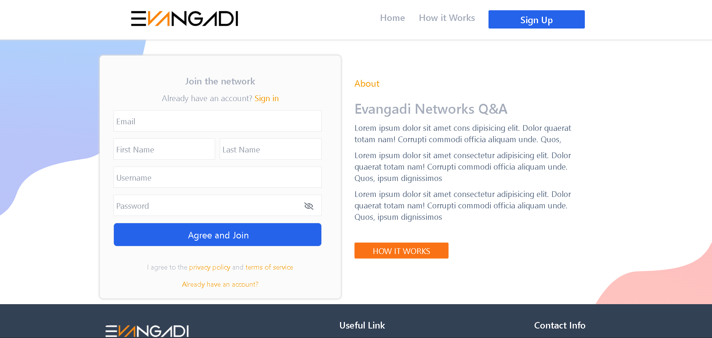

# Evangadi‑Forum

**Evangadi‑Forum** is a simple programming Q&A web application where users can ask questions about code, browse existing questions, and answer others. Think of it like a mini StackOverflow focused on programming topics.

---

## 💡 Features

- **User registration & login** (with JWT authentication)
- **Ask a question** with title, description, and programming tag
- **Search questions** by title or tag
- **Answer questions** from other users
- **View answers** and question details
- **Protected routes** — only authenticated users can ask or answer

---

## 🧱 Tech Stack

- **Backend**

  - Node.js, Express.js
  - MySQL (via `mysql2`)
  - `bcrypt` for password hashing
  - `jsonwebtoken` for authentication

- **Frontend**
  - React
  - React Router
  - Axios for HTTP requests

---

## 🚀 Getting Started

These instructions will help you set up the project on your local machine.

### Prerequisites

- Node.js (v16+)
- MySQL installed and running
- Git (to clone the repo)

### Installation

1. **Clone the repository**

   ```bash
   git clone https://github.com/your-username/evangadi-forum.git
   cd evangadi-forum/server
   ```

## 📸 Screenshot


